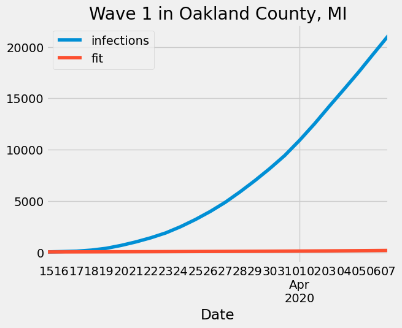
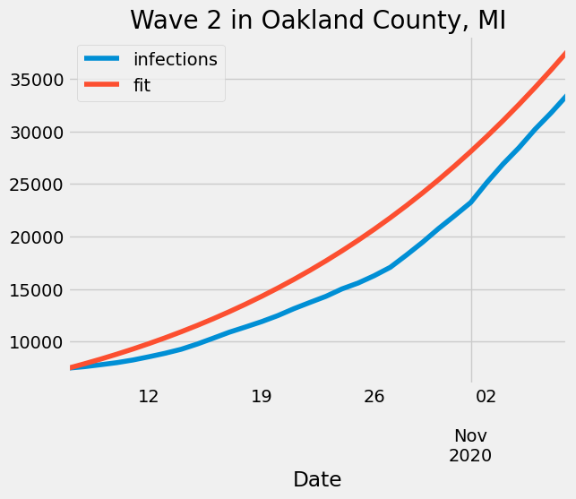
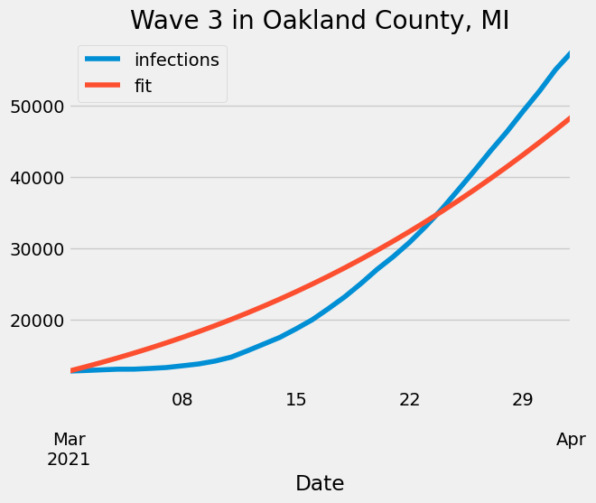

# Readme

## Project Description
This analysis is the first part of the project for the course DATA 512 - Human Centered Data Science.  

The goal of this analysis is to explore the impact of masking mandates on the spread of Covid 19 in Oakland county, MI.  
We perform a simple analysis by fitting a SIRS Model to the data to estimate the parameters related to infection spread.

## License
We use the following data sources for this assignment.

The data related to Covid cases can be found [here](https://www.kaggle.com/datasets/antgoldbloom/covid19-data-from-john-hopkins-university)  
It is licensed under [Attribution 4.0 International (CC BY 4.0)](https://creativecommons.org/licenses/by/4.0/)

CDC dataset on masking mandates can be found [here](https://data.cdc.gov/Policy-Surveillance/U-S-State-and-Territorial-Public-Mask-Mandates-Fro/62d6-pm5i)  
Its licensing information can be found [here](https://data.cdc.gov/Policy-Surveillance/U-S-State-and-Territorial-Public-Mask-Mandates-Fro/62d6-pm5i)

NYTimes survey on masking compliance can be found [here](https://github.com/nytimes/covid-19-data/tree/master/mask-use)  
Its licensing information can be found [here](https://github.com/nytimes/covid-19-data/blob/master/LICENSE)

## Folder Structure
```
├── data_clean
│   ├── cases.pq
│   ├── deaths.pq
│   ├── mask_compliance.pq
│   └── mask_mandates.pq
├── data_raw
│   ├── mask-mandate-by-county.csv
│   ├── mask-use-by-county.csv
│   ├── RAW_us_confirmed_cases.csv
│   └── RAW_us_deaths.csv
├── notebooks
│   └── visualize.ipynb
├── README.md
├── requirements.txt
├── src
│   ├── clean_data.py
│   ├── main.py
│   └── model.py
└── visualizations
    ├── main_viz.png
    ├── wave1_fit.png
    ├── wave2_fit.png
    ├── wave3_fit.png
    └── wave4_fit.png
```

## Input Files
There are four inputs used by the code in this repository.

The cases data is present in `data_raw/RAW_us_confirmed_cases.csv`  
The deaths data is present in `data_raw/RAW_us_deaths.csv`  
The mask mandates data is present in `data_raw/mask-mandate-by-county.csv`  
Note: Download this file from the link above and rename it `mask-mandate-by-county.csv` as it is too large to commit to Github  .
The mask compliance data is present in `data_raw/mask-use-by-county.csv`  

## Files Generated
The following data files are generated by the notebook.
- data_clean/cases.pq  
this stores the cleaned data of daily cases in the US at a county level
- data_clean/deaths.pq  
this stores the cleaned data of daily deaths in the US at a county level
- data_clean/mask_compliance.pq  
this stores the cleaned data of mask compliance in the US at a county level
- data_clean/mask_mandates.pq  
this stores the cleaned data of masking mandates in the US at a county level

## Running the code
Clone this repo using 
```bash
git clone git@github.com:abhishekiitm/data-512-project_part1.git
cd data-512-project_part1
```

First install the necessary Python libraries in a virtual environment by executing the following steps in the Terminal (assuming you are running Linux):  
```bash
$ virtualenv proj_env  
$ source proj_env/bin/activate
```  

Then install the libraries using  
```bash
$ pip install -r requirements.txt
```  

Download the raw files mentioned in the section `Input Files` if you don't already have them.  
Run clean data script to generate the cleaned data from the raw data.
```bash
$ python src/clean_data.py
```
  
Execute the notebook `notebooks/visualize.ipynb` using your choice of notebook environment (Jupyter Notebook or VS Code extension)

## Explanation of visualizations

The visualization below shows how the pandemic progressed in Oakland County, MI. The first thing captured is the days when masking mandates were present. 1 represents that the mandates were active and 0 represents that mandates were not in effect.  
We next have the daily case trends which can be noisy. Daily cases are calculated by subtracting the aggregate cases column from the aggregate cases the previous day. This gives the number of cases that were detected today.  
The next plot is the 7 day daily moving average of the daily cases. This smoothens the daily case trends as daily cases can be very noisy. Averaging them across seven days reduces the noise.  
Finally, we also plot an estimate of the total number of infected individuals at any given time. To get this estimate we sum all the cases in the last 10 days as we assume any tested person remains infectious for a total of 10 days. Secondly to get total infections we multiply it by a factor of 9 because of a study that estimated the actual infections that are missed since they were never tested.


The four plots below show the fitted curve vs the infections for the 4 waves.
This was used to estimate the beta parameters of the SIRS model in order to determine the impact of masking mandates. Please check the notebook [visualize.ipynb](notebooks/visualize.ipynb) for implementation details.






## Reflection
As part of the collaboration multiple different approaches were suggested. Some of these suggestions were along the lines of change point analysis, using time series based models such as ARIMA. However, I am skeptical of those approaches since it is tough to model the impact of mask in them. That is the reason why I have decided to go for a compartmental model based approach. I got the inspiration for this from Professor David's lecture where he had presented the case trend for different assumptions. I have then relied on Google to search for content to better understand how compartmental models work.

After some research, I have decided to use a very simple SIRS model to determine the impact of masking mandates. This simplistic analysis doesn't find any significant difference in the progression in Covid 19 when masking mandates were in place when compared to when there were no mandates.  
However, this is a very simplistic analysis and doesn't take into account factors like human networks, population characteristics, immunity due to vaccination, previous infections. Also we have only looked at a single county.  
We need to be careful about drawing conclusions from this as this model doesn't fully capture the intricate details necessary to determine the impact of masking. Further, we are only looking at the cases that tested positive and we don't have sufficient data to determine what the actual infection progression looked like. Thus, we need to take into account the limitations of both the data and the model while drawing insights from any data science project.
From the collaboration aspect I learned how to think about the problem from different viewpoints. I also learned how to go about researching different approaches quickly to identify which approach looks the most appropriate for the task at hand.